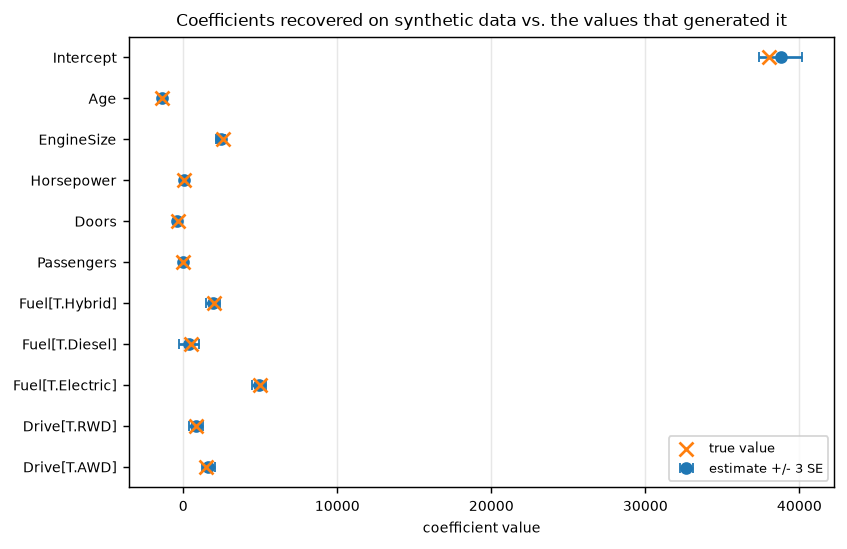

# isqs4370

[](https://github.com/vincal848/isqs4370/actions/workflows/tests.yml)

This project came out of a final course project for ISQS 4370 (Texas Tech), where I
loaded a used-car spreadsheet, label-encoded a few columns, and ran seven OLS
regressions on price, dropping one variable at a time by eyeing a printed VIF list.

I have since rebuilt it. **The original's regressions were all forced through the
origin** -- not one of the seven calls to `sm.OLS` included a constant column -- and
two of the three columns it label-encoded as integers (`Fuel_Type`, `Drivetrain`) are
nominal categories with no order to encode. On synthetic data built from known
coefficients, adding the missing intercept back moves R-squared from 0.9773 to 0.8172
and fixes a coefficient that had the wrong *sign*.


*Every recovered coefficient (blue, +/- 3 SE) lands on the true value (orange x) that
generated the synthetic data -- the check `validate.py` runs because the real
spreadsheet isn't available to check against.*

## At a glance

| | |
|---|---|
| **Methods** | VIF-based backward elimination; OLS via the statsmodels formula API |
| **Inputs** | `UsedCarData.xlsx` (not included -- see Notes) or synthetic data with known coefficients |
| **Outputs** | Drop sequence from elimination, fitted OLS summary |
| **Validation** | 20 tests: VIF identities, elimination order, coefficient recovery within 3 SE, schema validation, CLI runs |
| **Headline result** | No intercept inflates R-squared from 0.8172 to 0.9773 (uncentered) and flips a coefficient's sign |
| **Stack** | Python, pandas, statsmodels |

## Results

Every number below is from [`validate.py`](validate.py), which regenerates
[docs/VALIDATION.md](docs/VALIDATION.md) and the figure above, run on
`data.make_synthetic_used_cars(n=1000, seed=0)`.

**No intercept, same data, same four predictors:**

| Coefficient | True | No intercept | With intercept |
|---|---|---|---|
| Age | -1400.0 | -957.2 | -1380.2 |
| EngineSize | 2600.0 | 7168.7 | 2450.3 |
| Horsepower | 30.0 | 125.2 | 29.6 |
| Doors | -350.0 | 1190.3 | -450.7 |
| R-squared | -- | 0.9773 (uncentered) | 0.8172 |

**VIF elimination** on `Age, Mileage, EngineSize, Horsepower, Doors, Passengers`
(`Mileage` is generated from `Age` and has no true effect on price): elimination at
threshold 10 drops `Mileage` (VIF 161.36) in one step, which also brings
`Horsepower`'s VIF down from 24.80 to 1.00 -- it was never collinear with `Age` on its
own, only through `Mileage`.

**Coefficient recovery** after elimination, fit with `C(...)` for the two nominal
columns: every one of the 11 terms (intercept, 5 numeric, 3 fuel-type dummies, 2
drivetrain dummies) lands within 3 standard errors of the value that generated it.
Full table in [docs/VALIDATION.md](docs/VALIDATION.md).

## What was wrong

**No call to `sm.add_constant`, anywhere, in any of the seven regressions.** Every fit
was `Price = b1*x1 + ... + bk*xk`, forced through the origin. See the table above:
`Doors` comes back with the wrong sign, and R-squared is the *uncentered* figure
(`1 - SSE / sum(y^2)`), which gets credit for `Price` being far from zero rather than
for anything the model explains. `test_no_intercept_r_squared_is_the_uncentered_one`
pins the gap.

**`Fuel_Type` and `Drivetrain` were label-encoded as integers 0-4 and 0-5.** Both are
nominal -- there is no sense in which "Electric" is one unit past "Gasoline Hybrid".
Feeding that into OLS as a plain numeric column imposes an ordering the data doesn't
have. `model.fit_ols` takes a formula and expects `C(...)` for these columns instead;
`test_fit_ols_recovers_known_coefficients_within_three_standard_errors` only holds
with it.

**Chained assignment silently does nothing.** `df_car['Engine'][mask] = 0` and five
more lines like it set a value on a temporary copy of the column. Under copy-on-write
(the default since pandas 2.0, the only mode from pandas 3.0) this warns
`ChainedAssignmentError` and leaves the source frame completely unchanged.
`test_chained_assignment_silently_fails_to_set_the_value` reproduces it; `.loc`
assignment in `data.clean_used_cars` is the fix.

**`df_car.corr()` on a frame that still has object columns raises `TypeError` on
pandas >= 2.0.** It used to silently drop them; the script relied on that.
`data.numeric_correlations` selects numeric columns first.

**Written as a notebook, run as a script.** `result.summary()`, `df_car.dtypes`, and
`vif` appear as bare expressions, seven times each. In a notebook these print; as a
script they are evaluated and discarded, so `python project1.py` produces no output
at all. `run.py` prints every VIF step and every fit explicitly.

**`import matplotlib.pyplot as plt` is never used**, and the hardcoded path
`C:/Users/Owner/Downloads/UsedCarData.xlsx` only exists on the original machine.
`data.load_used_cars(path)` takes a path and validates what it loads.

## Quick start

```bash
pip install -r requirements.txt
```

```bash
python run.py demo                                   # synthetic data, known coefficients
python run.py fit --data path/to/UsedCarData.xlsx     # the real file, if you have it
```

Reproduce the documentation:

```bash
pytest tests -q         # 20 tests
python validate.py      # regenerates docs/VALIDATION.md and docs/img/
```

## Repository guide

| Path | Contents |
|---|---|
| `data.py` | `load_used_cars`, `clean_used_cars`, `make_synthetic_used_cars` |
| `model.py` | `vif_table`, `backward_vif_elimination`, `fit_ols` |
| `run.py` | `fit --data PATH`, `demo` |
| `validate.py` | Regenerates `docs/VALIDATION.md` and `docs/img/` |
| `tests/` | 20 tests, including a named regression for each defect above |
| `docs/VALIDATION.md` | Full tables: no-intercept bias, VIF elimination, coefficient recovery |
| `legacy/project1.py` | The original script, annotated. Not imported; known broken |

## Notes

- `UsedCarData.xlsx` is not redistributable and is not in this repository. The
  expected schema (`data.REQUIRED_COLUMNS`) is: `Price`, `Year`, `Kilometres`,
  `Engine`, `Fuel_Type`, `Drivetrain`, `Passengers`, `Doors`, `City`, `Highway`,
  `Transmission`, `Make`, `Model`, `Body_Type`. `run.py fit --data PATH` works against
  a file with that schema; everything in **Results** above runs on the synthetic
  stand-in instead.
- Tested against pandas 3.0, where copy-on-write is no longer optional -- the
  chained-assignment defect above is reproduced against that version specifically.
